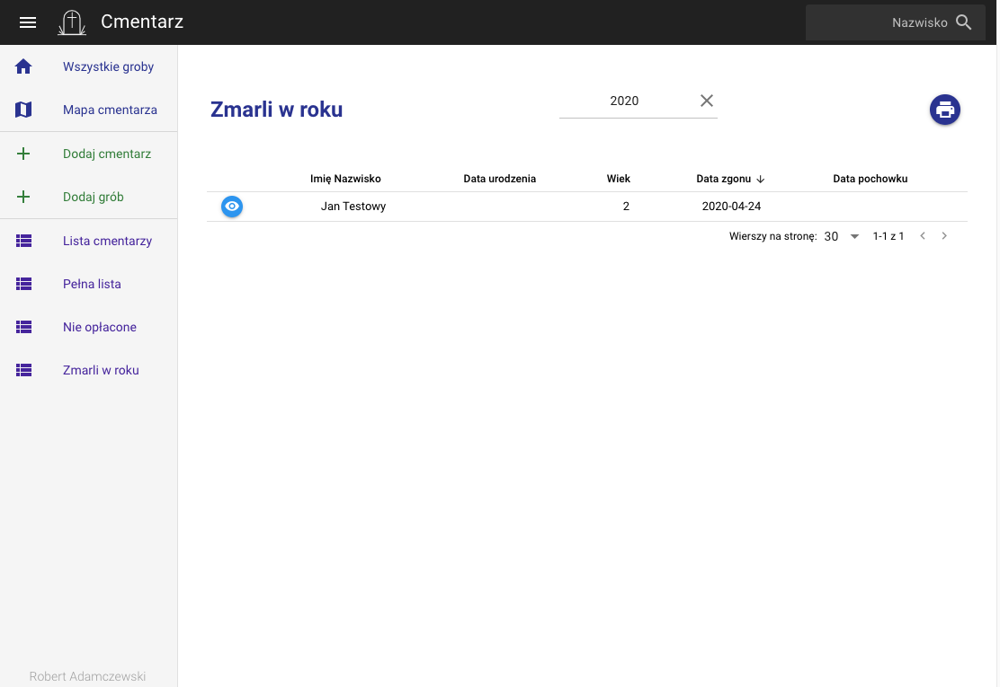

# Cmentarz (cm)

**Aplikacja do obsługi cmentarza.**

Informacje:

Baza danych oraz katalog ze zdjęciami znajdują się w katalogu użytkownika - '/dokumenty/cmentarz'.
Dane te można przenieść na inny komputer do tego samego katalogu i uruchomić aplikację.


## New components

- Autocomplete


- Photo manipulation


## App screenshots




## Install the dependencies
```bash
yarn
```

### Start the app in development mode (hot-code reloading, error reporting, etc.)
```bash
quasar dev -m electron
```

### Lint the files
```bash
yarn run lint
```

### Build the app for production
```bash
quasar build -m electron
```

### Customize the configuration
See [Configuring quasar.conf.js](https://quasar.dev/quasar-cli/quasar-conf-js).


## Version

v. 2.0.0

## Author

Robert Adamczewski
